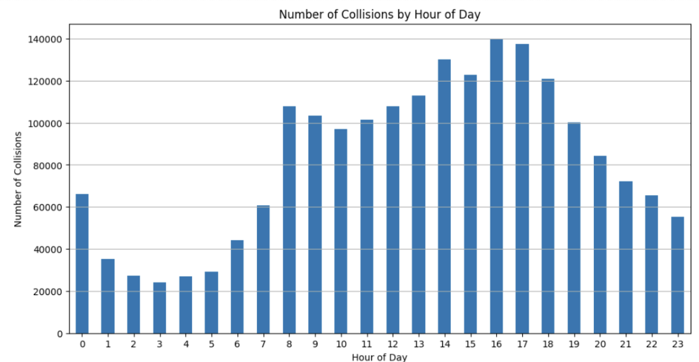
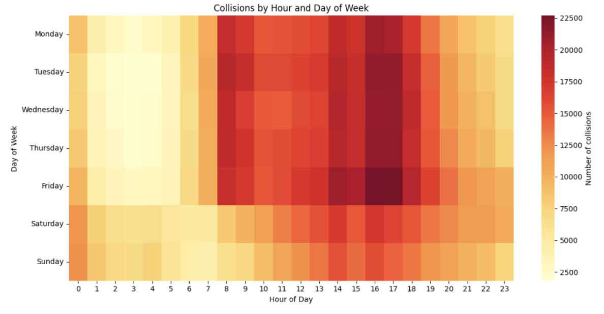

# NYC Open Data Motor Vehicle Collisions – Crashes Metadata

## Data Summary
The data [1] used in this project is the **“Motor Vehicle Collisions – Crashes” dataset**,
which is published by the New York City Police Department (NYPD) through the
NYC Open Data portal. It contains event-level information on all police-reported
motor vehicle collisions in New York City, with each row representing a single
crash event. The original dataset includes approximately 2.21 million records
and 29 attributes, covering factors such as crash date and time, borough and
location, number of persons injured or killed, and contributing factors. 
The data is provided in a structured CSV format.

## Provenance
The dataset originates from official police reports (MV-104AN forms), which must
be filed for collisions resulting in injury, fatality, or property damage exceeding
$1,000, in accordance with New York State reporting requirements. It contains
records of police-reported collisions dating back to 2012 but was first publicly
released in 2014, coinciding with the launch of New York City’s Vision Zero initiative.
Vision Zero marked the city’s commitment to eliminating traffic fatalities and prompted
the NYPD to adopt electronic, standardized crash reporting procedures, enabling
near–real-time record entry to the NYPD’s central data warehouse.
The dataset is updated daily by the NYPD and made available via CSV
download or API access through the NYC Open Data interface.
As a result, the “Motor Vehicle Collisions – Crashes” dataset now serves as
the most comprehensive, structured, and continuously updated record of vehicular
collision data in New York City.

## License
The dataset is governed by the NYC Open Data Terms of Use, which provide
broad public access and reuse rights. Under this policy, datasets are made
available “with no restrictions on use,” meaning they can be freely downloaded,
analyzed, and shared for research or public purposes.

## Ethical Statements
The NYC Open Data Law ensures that no personally identifiable information
is included and that all records comply with the city’s open data privacy
standards. Ethically, our analysis focuses on identifying temporal and
spatial trends in collision risk to inform public safety, without assigning
fault or drawing conclusions about individuals or specific neighborhoods.
However, the dataset is subject to potential biases that must be acknowledged.
Given that the dataset includes only police-reported collisions, there is a
risk of selection bias, as minor crashes or incidents without injury
may be underrepresented. Additionally, geographic and temporal biases
may arise from differences in reporting practices across boroughs, precincts,
or years, particularly surrounding policy changes or major events such as
the COVID-19 pandemic.

## Data Dictionary
| **Column Name**   | **Data Type** | **Description**                                                                                    |
| ----------------- | ------------- | -------------------------------------------------------------------------------------------------- |
| `collision_id`    | Integer       | Unique identifier for the crash event generated by NYPD systems                                    |
| `timestamp`       | Datetime      | Combined date and time when the collision occurred, in local NYC time                              |
| `location`        | String        | Geographic point of the collision, formatted as latitude/longitude pair using WGS 1984 (EPSG 4326) |
| `persons_injured` | Integer       | Count of total persons injured in the collision (all road users)                                   |
| `persons_killed`  | Integer       | Count of total persons killed in the collision (all road users)                                    |

## Explanatory Plots

**Figure 1**. Aggregate Hourly Distribution of Motor Vehicle Collisions
in New York City (2012–2025)

**Figure 2**. Hourly Distribution of Collisions by Day of Week (2012–2025)

## References
[1]	City of New York, 2014, “Motor Vehicle Collisions — Crashes,” NYC Open Data.
[Online]. Available: https://data.cityofnewyork.us/Public-Safety/Motor-Vehicle-Collisions-Crashes/h9gi-nx95 
